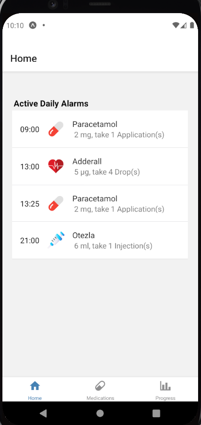
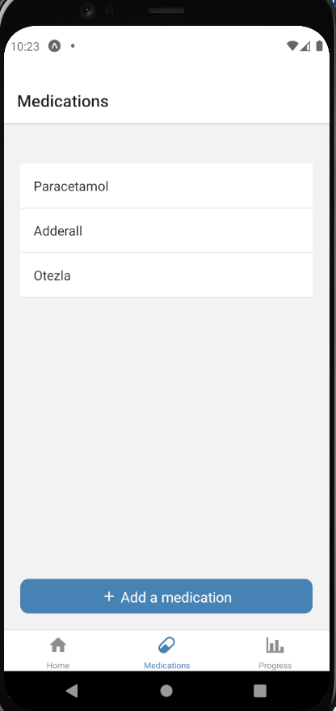
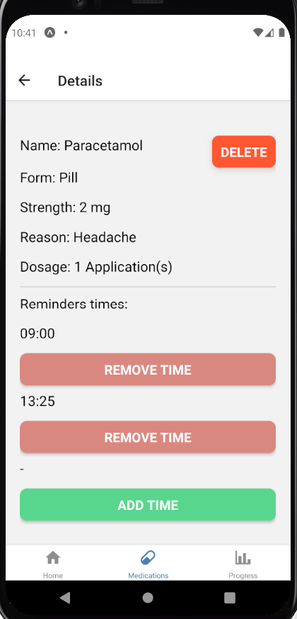
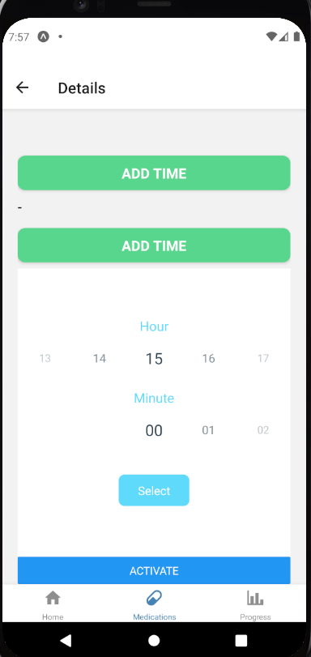
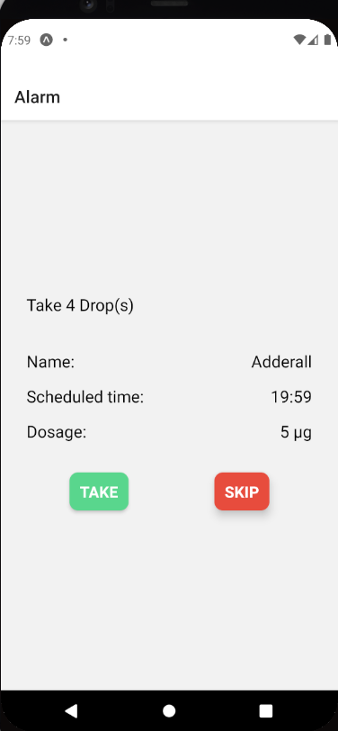
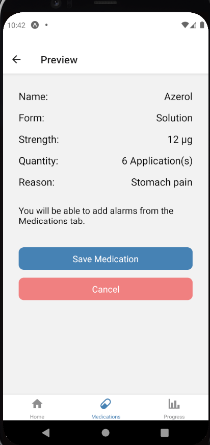
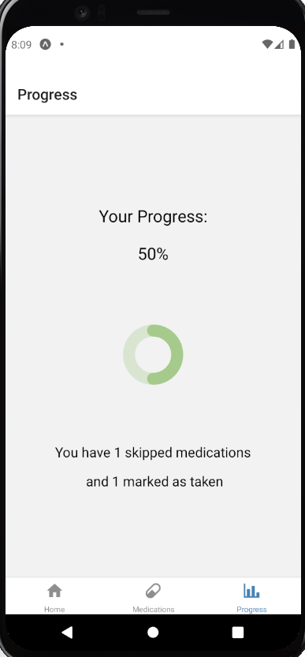

# Abstract
Every person could be prescribed many medications as part of a treatment, no matter of their age or health problems. People may experience issues taking their meds, even if the number of these is small. However, it is important for people to practice medication adherence when their well-being requires it.
This project’s mobile application targets people who need assistance while taking their medicines, although it focuses more on older adults, since they are more predisposed to non-adherence due to health issues and reduced cognitive abilities. Elderly’s preferences in the design of user interface are also often neglected by developers, which makes it difficult for this group of users to engage with mobile technology.
Mobile design principles and design guidelines were followed in this project in order appropriate user interface for older people to be accomplished.
The objective of this project was to develop a multiplatform mobile application that ensures people stay on track with their medicines by utilising reminders, to notify exactly when a medicine should be taken.

# To run:

To run and test the application on a pc, you will need an emulator provided by XCode or Android Dev Studio.
For android studio, create a emulator with x86 system.

In terminal, cd into the project dirctory and run:  
npm install  
to install dependecies. After that run:  
expo start   
to start the deployment server.  
You can then connect to the emulator from the interface or by pressin a for android and i for ios.

The application is not published to the stores.

